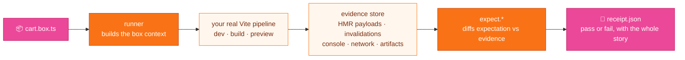
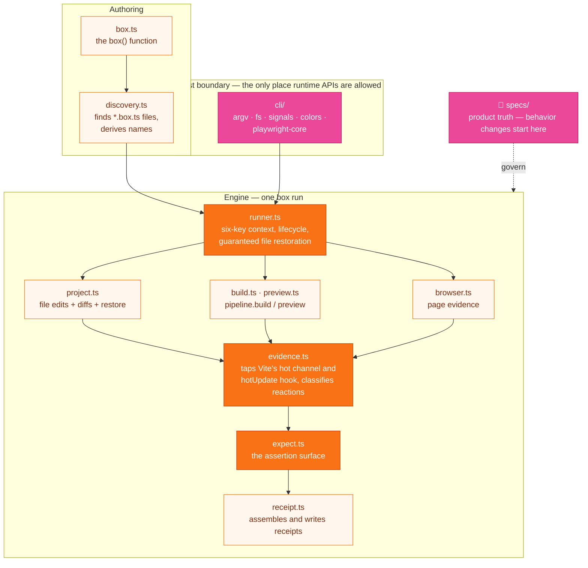
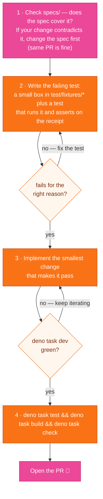

# Contributing to gumbox

gumbox runs **boxes** — small TypeScript files that drive a real Vite pipeline (dev server,
file edits, builds, a real browser) and write a JSON **receipt** proving what happened.

Contributing here means one of three things: making gumbox observe Vite more faithfully,
making receipts richer, or making the authoring API clearer. This guide gets you productive
on all three.

## Setup (two minutes)

The repo runs on Deno — no Node/npm/pnpm setup, `deno.json` is the whole manifest.

1. Install Deno: <https://docs.deno.com/runtime/getting-started/installation/>
2. `deno install` — Deno fetches the npm dependencies for you
3. `deno task dev` — the test suite in watch mode, your main feedback loop

| Task              | What it does                           |
| ----------------- | -------------------------------------- |
| `deno task dev`   | tests in watch mode (start here)       |
| `deno task test`  | run the suite once                     |
| `deno task check` | format + lint + types — CI runs this   |
| `deno task fmt`   | fix formatting when `check` complains  |
| `deno task build` | bundle to `dist/` (what consumers run) |

Browser-dependent tests use your installed Chrome/Edge via `playwright-core` and skip
automatically on machines without one — nothing to download.

## How a box run works

Everything in this codebase serves one loop:



A box looks like this:

```ts
import { box } from 'gumbox';

export default box('message updates without reload', async ({ browser, project, expect }) => {
	const page = await browser.visit('/demo');

	// Edit a real project file; gumbox restores it after the run.
	const change = await project.edit('src/message.ts', {
		replace: ['before', 'after'],
	});

	// Declare what Vite should have done, in the receipt's own vocabulary.
	await expect.edit(change, {
		client: { hmr: 'accepted', invalidated: ['/src/message.ts'] },
		ssr: { invalidated: [] },
	});
	await expect.page.text(page, '#message', 'after');
});
```

While that runs, gumbox records **evidence** — every hot-channel payload, invalidated module,
server restart, console error, navigation, and screenshot — whether or not the box asserts on
it. The run ends with a versioned JSON receipt under `.gumbox/receipts/<run>/` showing the
edit diff, each environment's reaction, every assertion (passed AND failed, with expected vs
observed), and a causal timeline.

### Two rules that shape most reviews

- **An assertion is a partial receipt.** `expect.edit(change, {...})` takes the same shape the
  receipt records — authors copy the outcome they expect. Don't add method-grammar assertions
  (`noFullReload`-style names were removed deliberately).
- **Receipts must not lie.** gumbox drives the _project's own_ Vite copy, never imposes
  `NODE_ENV`, and never replaces real pipeline behavior with mocks. If gumbox changes what the
  pipeline would have produced, that's a bug — we've shipped fixes for exactly that (see
  `src/vite-loader.ts`).

## Code map



Two places not on the diagram that you'll touch constantly:

- `test/fixtures/` — small real Vite apps the tests run boxes against; the box files inside
  them are executable documentation of the API
- `test/*.test.ts` — the suite; tests copy a fixture to a temp dir, run boxes through the real
  pipeline, then assert on the written receipt JSON

## Making a change



Testing rules you'll be reviewed against:

- Drive the **real** Vite pipeline; never mock it.
- Waits are event-driven (evidence events, page conditions) — never `sleep(250)`.
- Failure paths matter: if you add an assertion, prove it can fail (the suite has
  deliberate-failure boxes for exactly this).

### The rule that surprises newcomers

**`src/` and test bodies never import `node:*` or touch `process.*`/`Deno.*`.** Paths come
from `pathe`, module utils from `mlly`, globbing from `tinyglobby`, filesystem access through
the injected `GumboxFileSystem`. Only explicit host boundaries (`src/cli/host.ts`,
`test/support/*`) may adapt runtime APIs. Full policy:
`.claude/rules/runtime-agnostic-tooling.md`.

## See it used for real

The sibling `qwik-bundler` repo consumes gumbox via `link:../gumbox`: its `boxes/` directory
replaced thirteen smoke scripts with twelve boxes (HMR across client/SSR/workerd environments,
build artifact scans, state preservation). When you change the authoring API or receipts,
those boxes are the best reality check — and the best examples to read.

## Before you open a PR

```sh
deno task test && deno task build && deno task check
```

All green, focused diff, spec updated if behavior changed. Thanks for contributing!
